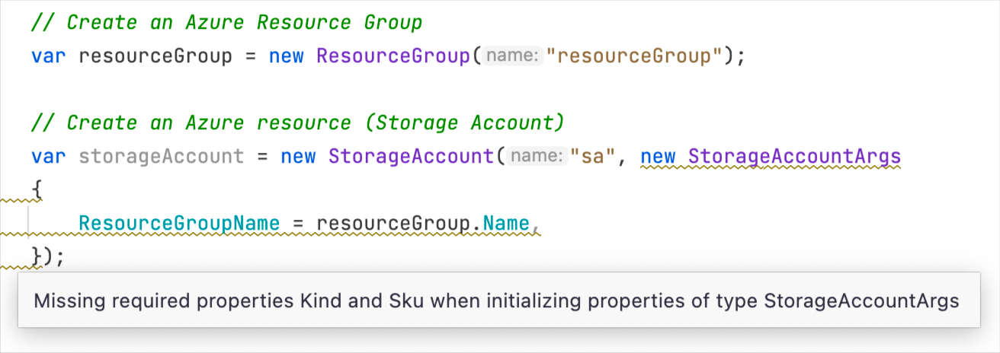

# PulumiCSharpAnalyzer [](https://www.nuget.org/packages/PulumiCSharpAnalyzer)

Roslyn-based static code analysis for pulumi programs written in C#.

 - Detecting missing required resource argument properties
 - Detecting missing required function invoke argument properties
 - Detects resource creation inside `.Apply(...)` calls and reports a warning

## Install 

```bash
dotnet add package PulumiCSharpAnalyzer
```

Which effectively adds the following package reference to your project file
```xml
<PackageReference Include="PulumiCSharpAnalyzer" Version="1.0.0">
  <IncludeAssets>runtime; build; native; contentfiles; analyzers; buildtransitive</IncludeAssets>
  <PrivateAssets>all</PrivateAssets>
</PackageReference>
```

### Detecting missing required resource argument properties



### Detecting missing required function invoke argument properties


### Detects resource creation inside `Apply(...)`


### Developing the project

```bash
cd ./build

# build the solution
dotnet run -- build

# run the tets
dotnet run -- test

# generate a local nuget file
dotnet run -- pack 

# publish the nuget
dotnet run -- publish
```
